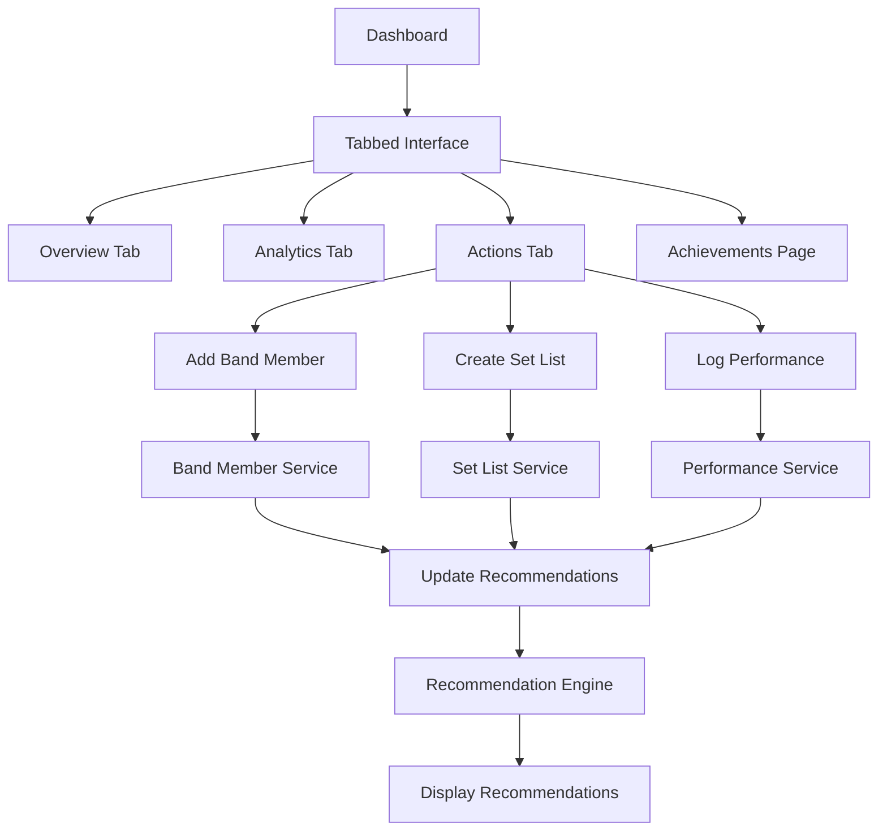

# Design Document

## Overview

This design document outlines a comprehensive transformation of the musician growth app focusing on user experience optimization, collaborative music tracking, and code efficiency. The design introduces a tabbed dashboard interface, band member management system, set list functionality, and removes testing overhead to accelerate MVP development while maintaining the existing Bootstrap-based architecture.

## Architecture

### High-Level Architecture Changes

The existing architecture will be streamlined and enhanced with these key modifications:

```
src/
├── components/
│   ├── Dashboard/
│   │   ├── DashboardTabs.tsx          # New tabbed interface
│   │   ├── OverviewTab.tsx            # Stats and recent activities
│   │   ├── AnalyticsTab.tsx           # Charts and analytics
│   │   └── ActionsTab.tsx             # Dedicated actions tab
│   ├── BandManagement/                # New feature directory
│   │   ├── BandMemberForm.tsx
│   │   ├── BandMemberList.tsx
│   │   ├── BandMemberDetails.tsx
│   │   └── BandMemberSelector.tsx
│   ├── SetListManagement/             # New feature directory
│   │   ├── SetListForm.tsx
│   │   ├── SetListDetails.tsx
│   │   ├── SetListSelector.tsx
│   │   └── SongForm.tsx
│   ├── AchievementsPage/              # Dedicated achievements page
│   │   ├── AchievementsGrid.tsx
│   │   └── AchievementCard.tsx
│   └── common/                        # Consolidated shared components
├── core/
│   ├── types.ts                       # Extended with band and setlist types
│   ├── recommendationEngine.ts        # Updated recommendation logic with industry knowledge
│   └── constants.ts                   # Consolidated constants
├── services/
│   ├── bandMemberService.ts           # Band member data operations
│   ├── setListService.ts              # Set list data operations
│   └── recommendationService.ts       # Updated recommendations with built-in industry knowledge
└── docs/                              # New documentation directory
    ├── future-enhancements.md
    ├── ai-assistant-features.md
    ├── venue-recommendations.md
    └── backend-integration.md
```

### Removed Components and Files

The following will be removed to streamline the codebase:
- All `.test.tsx` and `.test.ts` files
- `src/setupTests.ts`
- `src/test-utils.tsx`
- `vitest.config.ts`
- Any unused component files
- Redundant utility functions

### Data Flow Architecture



## Components and Interfaces

### New Data Models

#### Band Member Interface
```typescript
export interface BandMember {
  id: string;
  name: string;
  instrument: string;
  yearsExperience: number;
  joinDate: Date;
  profileId: string;
  participationHistory: ParticipationRecord[];
  createdAt: Date;
  updatedAt: Date;
}

export interface ParticipationRecord {
  activityId: string;
  activityType: 'performance' | 'practice' | 'recording';
  date: Date;
  role?: string; // specific role in that activity
}
```

#### Set List Interface
```typescript
export interface SetList {
  id: string;
  name: string;
  profileId: string;
  songs: SetListSong[];
  totalDuration?: number; // in minutes
  genres: string[];
  usageCount: number;
  lastUsed?: Date;
  createdAt: Date;
  updatedAt: Date;
}

export interface SetListSong {
  id: string;
  title: string;
  artist: string;
  genre: string;
  duration?: number; // in minutes
  bandMembers: string[]; // band member IDs who play this song
  position: number; // order in set list
}
```

#### Updated Performance Interface
```typescript
export interface UpdatedPerformance extends Performance {
  bandMembersPresent: string[]; // band member IDs
  setListUsed?: string; // set list ID
  songList?: string[]; // individual songs if no set list used
}
```

#### Web Recommendation Context
```typescript
export interface WebRecommendationContext {
  bandComposition: BandCompositionAnalysis;
  setListAnalysis: SetListAnalysis;
  genreCompatibility: GenreCompatibilityData;
  industryBenchmarks: IndustryBenchmarkData;
}

export interface BandCompositionAnalysis {
  currentInstruments: string[];
  missingInstruments: string[];
  experienceBalance: number;
  recommendedAdditions: InstrumentRecommendation[];
}

export interface SetListAnalysis {
  genreDiversity: number;
  averageSongDuration: number;
  genreDistribution: Record<string, number>;
  recommendedGenres: GenreRecommendation[];
}
```

### Component Design Specifications

#### DashboardTabs Component
```typescript
interface DashboardTabsProps {
  activeTab: 'overview' | 'analytics' | 'actions' | 'achievements';
  onTabChange: (tab: string) => void;
  profile: MusicianProfile;
}
```

**Visual Design:**
- Bootstrap nav-tabs styling with custom musician-themed colors
- Responsive tab layout that stacks on mobile
- Active tab highlighting with smooth transitions
- Tab content area with consistent padding and spacing

#### BandMemberForm Component
```typescript
interface BandMemberFormProps {
  onSubmit: (member: Omit<BandMember, 'id' | 'createdAt' | 'updatedAt'>) => void;
  onCancel: () => void;
  initialData?: Partial<BandMember>;
}
```

**Form Fields:**
- Name text input with validation
- Instrument dropdown with common instruments + custom option
- Years of experience number input with validation
- Join date picker (defaults to today)

#### SetListForm Component
```typescript
interface SetListFormProps {
  onSubmit: (setList: Omit<SetList, 'id' | 'createdAt' | 'updatedAt'>) => void;
  onCancel: () => void;
  bandMembers: BandMember[];
  initialData?: Partial<SetList>;
}
```

**Form Features:**
- Set list name input
- Dynamic song list with add/remove functionality
- Song details: title, artist, genre, duration
- Band member assignment per song
- Genre analysis and recommendations display

#### ActionsTab Component
```typescript
interface ActionsTabProps {
  onAddShow: () => void;
  onLogPractice: () => void;
  onRecordSong: () => void;
  onCreateGoal: () => void;
  onAddBandMember: () => void;
  onCreateSetList: () => void;
  onBulkEntry: () => void;
}
```

**Visual Design:**
- Dedicated tab for all quick actions
- Large, clear buttons with icons and descriptions
- Responsive grid layout (3-4 columns on desktop, 2 on tablet, 1 on mobile)
- Consistent button styling with hover effects

### Service Layer Design

#### BandMemberService
```typescript
class BandMemberService {
  async saveBandMember(profileId: string, member: BandMember): Promise<void>
  async getBandMembers(profileId: string): Promise<BandMember[]>
  async updateParticipation(memberId: string, activity: ParticipationRecord): Promise<void>
  async deleteBandMember(memberId: string): Promise<void>
  async getBandCompositionAnalysis(profileId: string): Promise<BandCompositionAnalysis>
}
```

#### SetListService
```typescript
class SetListService {
  async saveSetList(profileId: string, setList: SetList): Promise<void>
  async getSetLists(profileId: string): Promise<SetList[]>
  async updateSetListUsage(setListId: string): Promise<void>
  async deleteSetList(setListId: string): Promise<void>
  async analyzeSetListDiversity(setListId: string): Promise<SetListAnalysis>
}
```

#### RecommendationService (Updated)
```typescript
class RecommendationService {
  async getBandCompositionRecommendations(composition: BandCompositionAnalysis): Promise<Recommendation[]>
  async getGenreCompatibilityRecommendations(setList: SetList): Promise<Recommendation[]>
  async getIndustryBenchmarkRecommendations(profile: MusicianProfile): Promise<Recommendation[]>
  private getBuiltInIndustryData(): IndustryBenchmarkData
  private analyzeGenreCompatibility(genres: string[]): GenreCompatibilityData
}
```

## Data Models

### Database Schema Extensions

#### New IndexedDB Object Stores

**Band Members Store:**
```typescript
{
  keyPath: 'id',
  indexes: [
    { name: 'profileId', keyPath: 'profileId' },
    { name: 'instrument', keyPath: 'instrument' },
    { name: 'joinDate', keyPath: 'joinDate' }
  ]
}
```

**Set Lists Store:**
```typescript
{
  keyPath: 'id',
  indexes: [
    { name: 'profileId', keyPath: 'profileId' },
    { name: 'usageCount', keyPath: 'usageCount' },
    { name: 'lastUsed', keyPath: 'lastUsed' }
  ]
}
```

**Participation Records Store:**
```typescript
{
  keyPath: 'id',
  indexes: [
    { name: 'bandMemberId', keyPath: 'bandMemberId' },
    { name: 'activityType', keyPath: 'activityType' },
    { name: 'date', keyPath: 'date' }
  ]
}
```

### Goal Templates

```typescript
export const GOAL_TEMPLATES = {
  performance: [
    {
      id: 'perform_with_full_band',
      title: 'Perform X Shows with Full Band',
      description: 'Track performances with complete band lineup',
      linkedMetric: 'full_band_performances',
      requiresBandMembers: true
    },
    {
      id: 'diversify_setlists',
      title: 'Use X Different Set Lists',
      description: 'Track variety in performance repertoire',
      linkedMetric: 'unique_setlists_used',
      requiresSetLists: true
    }
  ],
  collaboration: [
    {
      id: 'build_band',
      title: 'Add X Band Members',
      description: 'Build your musical team',
      linkedMetric: 'band_member_count',
      category: 'collaboration'
    },
    {
      id: 'practice_with_band',
      title: 'Practice X Hours with Band',
      description: 'Track collaborative practice time',
      linkedMetric: 'band_practice_hours',
      requiresBandMembers: true
    }
  ]
};
```

## Error Handling

### Band Member Management Errors
```typescript
export class BandMemberError extends Error {
  constructor(
    message: string,
    public code: 'DUPLICATE_MEMBER' | 'INVALID_INSTRUMENT' | 'STORAGE_FAILED',
    public recoverable: boolean = true
  ) {
    super(message);
    this.name = 'BandMemberError';
  }
}
```

### Set List Management Errors
```typescript
export class SetListError extends Error {
  constructor(
    message: string,
    public code: 'EMPTY_SETLIST' | 'INVALID_SONG_DATA' | 'MISSING_BAND_MEMBERS',
    public setListId?: string
  ) {
    super(message);
    this.name = 'SetListError';
  }
}
```

## Visual Design and UX Improvements

### Dashboard Tabbed Interface Design

#### Tab Navigation
```css
.dashboard-tabs {
  border-bottom: 2px solid var(--bs-border-color);
  margin-bottom: 2rem;
}

.dashboard-tabs .nav-link {
  font-weight: 600;
  color: var(--bs-text-muted);
  border: none;
  border-bottom: 3px solid transparent;
  transition: all 0.3s ease;
}

.dashboard-tabs .nav-link.active {
  color: var(--bs-primary);
  border-bottom-color: var(--bs-primary);
  background: none;
}

.dashboard-tabs .nav-link:hover {
  color: var(--bs-primary);
  border-bottom-color: rgba(var(--bs-primary-rgb), 0.3);
}
```

#### Actions Tab Design
```css
.actions-tab {
  padding: 2rem;
}

.action-btn {
  background: white;
  border: 2px solid var(--bs-border-color);
  border-radius: 8px;
  padding: 1.5rem;
  text-align: center;
  transition: all 0.3s ease;
  height: 100%;
  margin-bottom: 1rem;
}

.action-btn:hover {
  border-color: var(--bs-primary);
  transform: translateY(-2px);
  box-shadow: 0 6px 12px rgba(0, 0, 0, 0.15);
}

.action-icon {
  font-size: 2rem;
  color: var(--bs-primary);
  margin-bottom: 0.5rem;
}
```

### Fixed Visual Issues

#### Chart Container Constraints
```css
.chart-container {
  max-height: 300px;
  overflow: hidden;
  position: relative;
}

.chart-container canvas {
  max-height: 100% !important;
  width: 100% !important;
}
```

#### Recent Activities Responsive Fix
```css
.recent-activities {
  max-height: 400px;
  overflow-y: auto;
  padding-right: 0.5rem;
}

.recent-activities::-webkit-scrollbar {
  width: 6px;
}

.recent-activities::-webkit-scrollbar-thumb {
  background: var(--bs-secondary);
  border-radius: 3px;
}
```

#### Recorded Songs Card Fix
```css
.recorded-songs-card::before {
  display: none; /* Remove any pseudo-elements causing blue bubble */
}

.recorded-songs-card .card-body {
  position: relative;
  z-index: 1;
}
```

### Band Member and Set List UI Design

#### Band Member Card Design
```css
.band-member-card {
  background: white;
  border: 1px solid var(--bs-border-color);
  border-radius: 8px;
  padding: 1rem;
  margin-bottom: 1rem;
  transition: box-shadow 0.3s ease;
}

.band-member-card:hover {
  box-shadow: 0 4px 8px rgba(0, 0, 0, 0.1);
}

.instrument-badge {
  background: var(--bs-primary);
  color: white;
  padding: 0.25rem 0.5rem;
  border-radius: 12px;
  font-size: 0.8rem;
}

.experience-indicator {
  color: var(--bs-text-muted);
  font-size: 0.9rem;
}
```

#### Set List Design
```css
.setlist-card {
  background: linear-gradient(135deg, #fff 0%, #f8f9fa 100%);
  border: 1px solid var(--bs-border-color);
  border-radius: 12px;
  padding: 1.5rem;
  margin-bottom: 1rem;
}

.song-item {
  background: white;
  border: 1px solid #e9ecef;
  border-radius: 6px;
  padding: 0.75rem;
  margin-bottom: 0.5rem;
  display: flex;
  justify-content: space-between;
  align-items: center;
}

.genre-tag {
  background: var(--bs-info);
  color: white;
  padding: 0.2rem 0.4rem;
  border-radius: 8px;
  font-size: 0.7rem;
}
```

## Enhanced Recommendation Engine

### Industry Data Integration

The recommendation engine will incorporate built-in music industry knowledge:

#### Band Composition Recommendations
```typescript
const INDUSTRY_BAND_COMPOSITIONS = {
  rock: ['guitar', 'bass', 'drums', 'vocals'],
  country: ['guitar', 'bass', 'drums', 'vocals', 'fiddle'],
  jazz: ['piano', 'bass', 'drums', 'saxophone', 'vocals'],
  folk: ['guitar', 'vocals', 'harmonica', 'banjo'],
  electronic: ['synthesizer', 'drum_machine', 'vocals', 'guitar']
};
```

#### Genre Compatibility Matrix
```typescript
const GENRE_COMPATIBILITY = {
  country: ['classic_rock', 'folk', 'blues', 'americana'],
  rock: ['blues', 'country', 'pop', 'alternative'],
  jazz: ['blues', 'soul', 'funk', 'latin'],
  folk: ['country', 'indie', 'acoustic', 'americana'],
  pop: ['rock', 'r&b', 'dance', 'indie']
};
```

### Recommendation Algorithm Enhancement

```typescript
class RecommendationEngine {
  generateBandRecommendations(composition: BandCompositionAnalysis): Recommendation[] {
    const recommendations = [];
    
    // Missing instrument recommendations
    if (composition.missingInstruments.length > 0) {
      recommendations.push({
        type: 'band_composition',
        priority: 'high',
        title: `Consider adding a ${composition.missingInstruments[0]}`,
        description: `Based on your genre and current lineup, a ${composition.missingInstruments[0]} would complete your sound`,
        source: 'industry_standards'
      });
    }
    
    // Experience balance recommendations
    if (composition.experienceBalance < 0.7) {
      recommendations.push({
        type: 'band_development',
        priority: 'medium',
        title: 'Consider mentoring newer band members',
        description: 'Your experience levels vary significantly. Regular practice sessions could help balance skills',
        source: 'collaboration_best_practices'
      });
    }
    
    return recommendations;
  }
  
  generateSetListRecommendations(analysis: SetListAnalysis): Recommendation[] {
    const recommendations = [];
    
    // Genre diversity recommendations
    if (analysis.genreDiversity < 0.5) {
      const compatibleGenres = this.getCompatibleGenres(analysis.genreDistribution);
      recommendations.push({
        type: 'setlist_diversity',
        priority: 'medium',
        title: `Add ${compatibleGenres[0]} songs to your set list`,
        description: `Your set list is primarily ${Object.keys(analysis.genreDistribution)[0]}. Adding ${compatibleGenres[0]} would create better audience engagement`,
        source: 'genre_compatibility_analysis'
      });
    }
    
    return recommendations;
  }
}
```

## Performance Optimization

### Code Consolidation Strategy

1. **Component Consolidation**: Merge similar components and remove duplicated logic
2. **Service Layer Optimization**: Combine related services and eliminate redundant API calls
3. **Bundle Size Reduction**: Remove unused dependencies and optimize imports
4. **Lazy Loading**: Implement code splitting for non-critical components

### Memory Management

```typescript
// Optimized data loading with caching
class OptimizedDataService {
  private cache = new Map<string, { data: any; timestamp: number }>();
  private readonly CACHE_DURATION = 5 * 60 * 1000; // 5 minutes
  
  async getData(key: string, fetcher: () => Promise<any>): Promise<any> {
    const cached = this.cache.get(key);
    if (cached && Date.now() - cached.timestamp < this.CACHE_DURATION) {
      return cached.data;
    }
    
    const data = await fetcher();
    this.cache.set(key, { data, timestamp: Date.now() });
    return data;
  }
}
```

### Build Optimization

```typescript
// Vite config optimization for production
export default defineConfig({
  build: {
    rollupOptions: {
      output: {
        manualChunks: {
          vendor: ['react', 'react-dom'],
          bootstrap: ['bootstrap', 'react-bootstrap'],
          charts: ['chart.js', 'react-chartjs-2']
        }
      }
    },
    minify: 'terser',
    terserOptions: {
      compress: {
        drop_console: true,
        drop_debugger: true
      }
    }
  }
});
```

## Future Enhancements Documentation Structure

### Documentation Organization

```
docs/
├── future-enhancements.md          # Overview of planned features
├── ai-assistant-features.md        # Natural language processing features
├── venue-recommendations.md        # Location-based venue discovery
├── backend-integration.md          # API and cloud integration plans
├── advanced-analytics.md           # Predictive modeling and insights
├── social-features.md              # Networking and collaboration tools
├── monetization-features.md        # Revenue optimization tools
└── mobile-app-features.md          # Native mobile application plans
```

### AI Assistant Feature Specification

The AI assistant will enable natural language updates:

```typescript
interface AIAssistantRequest {
  userInput: string; // "I played a show last night at the Blue Cavern with my full band"
  context: MusicianProfile;
}

interface AIAssistantResponse {
  parsedData: {
    activityType: 'performance' | 'practice' | 'recording';
    venue?: string;
    date?: Date;
    bandMembers?: string[];
    earnings?: number;
  };
  confidence: number;
  suggestedActions: string[];
}
```

This comprehensive design provides a solid foundation for implementing all requested features while maintaining code quality, performance, and user experience standards.