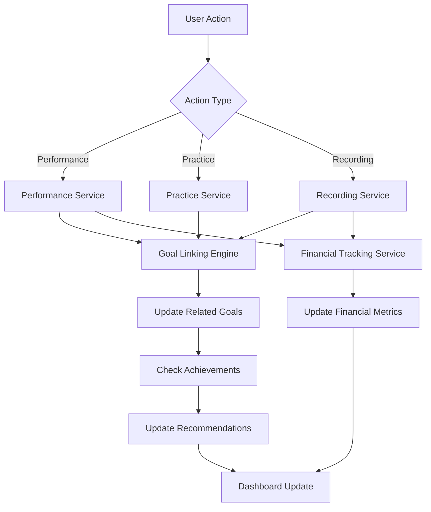

# Design Document

## Overview

This design document outlines the comprehensive enhancement of the musician growth app with recording session tracking, intelligent goal-to-action linking, expanded recommendation algorithms, and extended achievement systems. The design maintains the existing architecture patterns while introducing new data models, services, and UI components that seamlessly integrate with the current Bootstrap-based, IndexedDB-powered application.

The enhancement focuses on creating a cohesive ecosystem where user activities automatically update related goals, financial tracking spans all revenue and expense sources, and personalized recommendations adapt to evolving user behavior patterns.

## Architecture

### High-Level Architecture Changes

The existing architecture remains largely intact with these key additions:

```
src/
├── components/
│   ├── Dashboard/
│   │   ├── RecordedSongsCard.tsx      # New dashboard card
│   │   └── SettingsButton.tsx         # Settings access component
│   ├── RecordingManagement/           # New feature directory
│   │   ├── RecordingForm.tsx
│   │   ├── RecordingDetails.tsx
│   │   ├── RecordingList.tsx
│   │   └── BulkRecordingEntry.tsx
│   ├── Settings/                      # New settings management
│   │   ├── SettingsPage.tsx
│   │   └── SurveyResponseEditor.tsx
│   └── GoalManagement/
│       └── LinkedGoalCreation.tsx     # Enhanced goal creation
├── core/
│   ├── types.ts                       # Extended with recording types
│   ├── goalLinkingEngine.ts          # New goal-action linking logic
│   └── recommendationEngine.ts       # Enhanced existing recommendation system
├── services/
│   ├── recordingService.ts            # New recording data service
│   ├── goalLinkingService.ts          # Goal synchronization service
│   └── financialTrackingService.ts    # Unified financial tracking
└── utils/
    └── goalLinkingUtils.ts            # Goal-action mapping utilities
```

### Data Flow Architecture



## Components and Interfaces

### New Data Models

#### Recording Session Interface
```typescript
export interface RecordingSession {
  id: string;
  date: Date;
  location: string;
  cost: number;
  songs: RecordedSong[];
  notes?: string;
  totalPlays: number;
  totalRevenue: number;
  createdAt: Date;
  updatedAt: Date;
}

export interface RecordedSong {
  id: string;
  title: string;
  duration?: number; // in seconds
  plays: number;
  revenue: number;
  distributionPlatforms: string[];
  recordingSessionId: string;
}
```

#### Enhanced Goal Interface
```typescript
export interface EnhancedGoal extends Goal {
  linkedActionType?: 'performance' | 'practice' | 'recording' | 'financial';
  linkedMetric: string; // Required: 'show_count', 'earnings_total', 'recording_count', etc.
  autoUpdate: boolean;
  progressHistory: GoalProgressEntry[];
}

export interface GoalProgressEntry {
  date: Date;
  value: number;
  triggeredBy?: string; // ID of the action that triggered this update
}
```

#### Financial Tracking Interface
```typescript
export interface FinancialSummary {
  totalRevenue: number;
  totalExpenses: number;
  netIncome: number;
  revenueBySource: {
    performances: number;
    recordings: number;
    other: number;
  };
  expensesByCategory: {
    recording: number;
    equipment: number;
    marketing: number;
    other: number;
  };
  monthlyTrends: MonthlyFinancialData[];
}

export interface MonthlyFinancialData {
  month: string;
  revenue: number;
  expenses: number;
  netIncome: number;
}
```

### Component Design Specifications

#### RecordedSongsCard Component
```typescript
interface RecordedSongsCardProps {
  recordings: RecordingSession[];
  onRecordingClick: (recording: RecordingSession) => void;
  onAddRecording: () => void;
}
```

**Visual Design:**
- Follows existing dashboard card styling with Bootstrap classes
- Displays up to 3 recent recordings with song count and total plays
- Shows empty state with call-to-action when no recordings exist
- Includes quick stats: total songs recorded, total plays, total revenue

#### RecordingForm Component
```typescript
interface RecordingFormProps {
  onSubmit: (recording: Omit<RecordingSession, 'id' | 'createdAt' | 'updatedAt'>) => void;
  onCancel: () => void;
  initialData?: Partial<RecordingSession>;
}
```

**Form Fields:**
- Date picker (defaults to today)
- Location text input with autocomplete from previous entries
- Cost number input with currency formatting
- Dynamic song list with add/remove functionality
- Notes textarea (optional)

#### SettingsPage Component
```typescript
interface SettingsPageProps {
  profile: MusicianProfile;
  onSave: (updatedResponses: SurveyResponses) => void;
  onCancel: () => void;
}
```

**Settings Sections:**
- Survey Response Editor (editable form matching original survey)
- Notification Preferences
- Data Export Options
- Profile Management

### Service Layer Design

#### RecordingService
```typescript
class RecordingService {
  async saveRecording(profileId: string, recording: RecordingSession): Promise<void>
  async getRecordings(profileId: string): Promise<RecordingSession[]>
  async updateSongMetrics(songId: string, plays: number, revenue: number): Promise<void>
  async bulkAddRecordings(profileId: string, recordings: RecordingSession[]): Promise<void>
  async deleteRecording(recordingId: string): Promise<void>
}
```

#### GoalLinkingService
```typescript
class GoalLinkingService {
  async updateGoalsForAction(profileId: string, actionType: string, actionData: any): Promise<void>
  async createLinkedGoal(profileId: string, goalTemplate: GoalTemplate): Promise<EnhancedGoal>
  async getAvailableGoalTemplates(): Promise<GoalTemplate[]>
  private calculateGoalProgress(goal: EnhancedGoal, allUserData: UserActivityData): number
}
```

#### FinancialTrackingService
```typescript
class FinancialTrackingService {
  async calculateFinancialSummary(profileId: string): Promise<FinancialSummary>
  async addExpense(profileId: string, expense: ExpenseRecord): Promise<void>
  async addRevenue(profileId: string, revenue: RevenueRecord): Promise<void>
  async getMonthlyTrends(profileId: string, months: number): Promise<MonthlyFinancialData[]>
}
```

## Data Models

### Database Schema Extensions

#### New IndexedDB Object Stores

**Recording Sessions Store:**
```typescript
{
  keyPath: 'id',
  indexes: [
    { name: 'profileId', keyPath: 'profileId' },
    { name: 'date', keyPath: 'date' },
    { name: 'cost', keyPath: 'cost' }
  ]
}
```

**Recorded Songs Store:**
```typescript
{
  keyPath: 'id',
  indexes: [
    { name: 'recordingSessionId', keyPath: 'recordingSessionId' },
    { name: 'plays', keyPath: 'plays' },
    { name: 'revenue', keyPath: 'revenue' }
  ]
}
```

**Financial Transactions Store:**
```typescript
{
  keyPath: 'id',
  indexes: [
    { name: 'profileId', keyPath: 'profileId' },
    { name: 'type', keyPath: 'type' }, // 'revenue' | 'expense'
    { name: 'category', keyPath: 'category' },
    { name: 'date', keyPath: 'date' }
  ]
}
```

**Survey Responses History Store:**
```typescript
{
  keyPath: 'id',
  indexes: [
    { name: 'profileId', keyPath: 'profileId' },
    { name: 'updatedAt', keyPath: 'updatedAt' }
  ]
}
```

### Goal Templates Configuration

```typescript
export const GOAL_TEMPLATES = {
  performance: [
    {
      id: 'perform_shows_count',
      title: 'Perform X Shows',
      description: 'Set a target number of performances to complete',
      linkedMetric: 'show_count',
      category: 'performance'
    },
    {
      id: 'earn_from_shows',
      title: 'Earn $X from Performances',
      description: 'Set a target earnings amount from live performances',
      linkedMetric: 'performance_earnings',
      category: 'financial'
    }
  ],
  practice: [
    {
      id: 'practice_hours',
      title: 'Practice X Hours',
      description: 'Set a target for total practice time',
      linkedMetric: 'practice_time_total',
      category: 'skill'
    },
    {
      id: 'practice_consistency',
      title: 'Practice X Days per Week',
      description: 'Set a target for practice frequency',
      linkedMetric: 'practice_frequency',
      category: 'skill'
    }
  ],
  recording: [
    {
      id: 'record_songs_count',
      title: 'Record X Songs',
      description: 'Set a target number of songs to record',
      linkedMetric: 'recorded_songs_count',
      category: 'recording'
    },
    {
      id: 'recording_revenue',
      title: 'Earn $X from Recordings',
      description: 'Set a target earnings amount from recorded music',
      linkedMetric: 'recording_revenue',
      category: 'financial'
    }
  ]
};
```

## Error Handling

### Recording Session Error Handling

```typescript
export class RecordingError extends Error {
  constructor(
    message: string,
    public code: 'INVALID_COST' | 'MISSING_SONGS' | 'STORAGE_FAILED' | 'DUPLICATE_SESSION',
    public recoverable: boolean = true
  ) {
    super(message);
    this.name = 'RecordingError';
  }
}
```

### Goal Linking Error Handling

```typescript
export class GoalLinkingError extends Error {
  constructor(
    message: string,
    public code: 'GOAL_NOT_FOUND' | 'INVALID_METRIC' | 'CALCULATION_FAILED',
    public goalId?: string
  ) {
    super(message);
    this.name = 'GoalLinkingError';
  }
}
```

### Error Recovery Strategies

1. **Storage Failures**: Implement retry logic with exponential backoff
2. **Goal Calculation Errors**: Fall back to manual goal tracking
3. **Financial Calculation Errors**: Display warning and allow manual correction
4. **Recommendation Engine Failures**: Show cached recommendations or basic fallbacks

## Testing Strategy

### Unit Testing Approach

#### Component Testing
```typescript
// Example test structure for RecordingForm
describe('RecordingForm', () => {
  it('should validate required fields before submission', () => {
    // Test form validation
  });
  
  it('should handle dynamic song list additions', () => {
    // Test song management
  });
  
  it('should format currency inputs correctly', () => {
    // Test input formatting
  });
});
```

#### Service Testing
```typescript
// Example test structure for GoalLinkingService
describe('GoalLinkingService', () => {
  it('should update performance goals when show is added', async () => {
    // Test goal-action linking
  });
  
  it('should handle multiple goal updates from single action', async () => {
    // Test complex linking scenarios
  });
  
  it('should not update goals when linking is disabled', async () => {
    // Test configuration handling
  });
});
```

### Integration Testing Strategy

1. **End-to-End User Flows**: Test complete workflows from action entry to goal completion
2. **Data Consistency Tests**: Verify financial calculations across all data sources
3. **Performance Tests**: Ensure dashboard loads quickly with large datasets
4. **Cross-Browser Compatibility**: Test IndexedDB operations across browsers

### Accessibility Testing

1. **Keyboard Navigation**: All new forms and interactions must be keyboard accessible
2. **Screen Reader Compatibility**: Proper ARIA labels and semantic HTML
3. **Color Contrast**: All new UI elements meet WCAG 2.1 AA standards
4. **Focus Management**: Clear focus indicators and logical tab order

## Enhanced Recommendation Engine Design

### Algorithm Architecture

```typescript
interface RecommendationContext {
  profile: MusicianProfile;
  recentActivities: ActivitySummary;
  financialData: FinancialSummary;
  goalProgress: GoalProgressSummary;
  seasonalFactors: SeasonalData;
}

interface RecommendationRule {
  id: string;
  category: RecommendationCategory;
  priority: number;
  condition: (context: RecommendationContext) => boolean;
  generator: (context: RecommendationContext) => Recommendation;
  weight: number;
}
```

### New Recommendation Categories

1. **Revenue Optimization**: Based on earnings patterns and market analysis
2. **Creative Development**: Based on recording activity and artistic growth
3. **Market Expansion**: Based on venue diversity and audience growth
4. **Efficiency Improvement**: Based on practice-to-performance ratios
5. **Business Development**: Based on financial management and career progression

### Recommendation Personalization

The enhanced engine will consider:
- Historical survey response changes
- Goal completion patterns
- Activity frequency trends
- Financial performance metrics
- Seasonal performance variations
- Peer comparison data (anonymized)

### Performance Optimization

1. **Caching Strategy**: Cache recommendation calculations for 24 hours
2. **Incremental Updates**: Only recalculate affected recommendations when data changes
3. **Lazy Loading**: Load recommendation details on demand
4. **Background Processing**: Calculate complex recommendations asynchronously

## Visual Design Consistency

### Maintaining Current Look and Feel

The design will strictly adhere to the existing visual patterns to ensure seamless integration:

#### Bootstrap Integration
All new components will use the existing Bootstrap 5 classes and patterns:
- **Cards**: `.card`, `.card-body`, `.card-title`, `.card-text` for all dashboard cards
- **Forms**: `.form-control`, `.form-label`, `.form-select` for consistent input styling
- **Buttons**: `.btn`, `.btn-primary`, `.btn-secondary` matching existing button styles
- **Grid System**: `.row`, `.col-*` for responsive layouts identical to current dashboard
- **Spacing**: Existing margin/padding utilities (`.mb-3`, `.p-4`, etc.)

#### Typography Consistency
- **Headings**: Follow existing hierarchy (h1-h6) with same font weights and sizes
- **Body Text**: Use existing `.text-muted`, `.text-primary` classes for secondary information
- **Labels**: Maintain current form label styling and positioning

#### Color Scheme Adherence
```css
/* Extend existing color variables, don't override */
:root {
  /* New colors that complement existing palette */
  --recording-accent: #e74c3c;    /* Red for recording theme */
  --goal-linked: #28a745;         /* Bootstrap success green */
  --goal-unlinked: #6c757d;       /* Bootstrap secondary gray */
  --financial-positive: #28a745;   /* Bootstrap success */
  --financial-negative: #dc3545;   /* Bootstrap danger */
}
```

#### Dashboard Card Consistency
New cards will match existing patterns exactly:
```typescript
// RecordedSongsCard will follow same structure as existing cards
<div className="card h-100">
  <div className="card-body">
    <h5 className="card-title">
      <i className="fas fa-microphone me-2"></i>
      Recorded Songs
    </h5>
    <div className="card-text">
      {/* Content matching existing card layouts */}
    </div>
  </div>
</div>
```

#### Form Styling Standards
All new forms will replicate existing form patterns:
- **Input Groups**: Same styling as performance/practice entry forms
- **Validation**: Identical error message styling and positioning
- **Submit Buttons**: Same button placement and styling as current forms
- **Field Layout**: Consistent spacing and alignment with existing forms

#### Icon Usage
- **FontAwesome Icons**: Use existing icon library with consistent sizing
- **Recording Icons**: `fa-microphone`, `fa-music`, `fa-record-vinyl`
- **Goal Icons**: `fa-target`, `fa-link` for linked goals
- **Financial Icons**: `fa-dollar-sign`, `fa-chart-line`

#### Navigation Consistency
- **Settings Access**: Follow existing navigation patterns (likely header button)
- **Profile Switching**: Use existing profile selection UI patterns
- **Breadcrumbs**: If needed, match existing navigation styling

### Component-Specific Design Standards

#### RecordedSongsCard Design
```css
.recorded-songs-card {
  /* Inherits all existing card styles */
}

.recorded-songs-card .song-item {
  /* Matches existing list item styling from other cards */
  padding: 0.5rem 0;
  border-bottom: 1px solid var(--bs-border-color);
}

.recorded-songs-card .empty-state {
  /* Matches existing empty state styling */
  text-align: center;
  color: var(--bs-text-muted);
  padding: 2rem 1rem;
}
```

#### RecordingForm Design
```css
.recording-form {
  /* Uses existing form container styling */
}

.song-list-item {
  /* Matches existing dynamic list item styling */
  background: var(--bs-light);
  border: 1px solid var(--bs-border-color);
  border-radius: var(--bs-border-radius);
  margin-bottom: 0.5rem;
  padding: 1rem;
}
```

#### Settings Page Design
```css
.settings-page {
  /* Follows existing page layout patterns */
  max-width: 800px;
  margin: 0 auto;
  padding: 2rem 1rem;
}

.settings-section {
  /* Matches existing section styling */
  background: white;
  border-radius: var(--bs-border-radius);
  box-shadow: var(--bs-box-shadow-sm);
  margin-bottom: 2rem;
  padding: 2rem;
}
```

#### Goal Linking Visual Indicators
```css
.goal-linked-badge {
  /* Small green badge indicating auto-updating goals */
  background: var(--goal-linked);
  color: white;
  font-size: 0.75rem;
  padding: 0.25rem 0.5rem;
  border-radius: 1rem;
}

.goal-progress-bar {
  /* Matches existing progress bar styling */
  /* Uses Bootstrap's .progress and .progress-bar classes */
}
```

### Responsive Design Maintenance

#### Mobile Optimization
- **Card Stacking**: New cards follow existing mobile stacking behavior
- **Form Layout**: Recording forms adapt using same responsive patterns
- **Navigation**: Settings and profile switching use existing mobile navigation

#### Tablet Considerations
- **Grid Behavior**: New dashboard cards participate in existing grid system
- **Touch Targets**: All interactive elements meet existing touch target sizes
- **Spacing**: Maintain consistent spacing across all screen sizes

### Animation and Interaction Consistency

#### Hover Effects
- **Cards**: Same subtle hover effects as existing dashboard cards
- **Buttons**: Identical hover transitions and color changes
- **Links**: Consistent text decoration and color changes

#### Loading States
- **Spinners**: Use existing spinner styling and positioning
- **Skeleton Loading**: If implemented, match existing loading patterns
- **Progress Indicators**: Follow existing progress bar styling

#### Transitions
- **Page Navigation**: Same transition timing and effects
- **Modal Dialogs**: If used, match existing modal styling
- **Form Validation**: Identical error state transitions

This comprehensive approach ensures that all new features feel like natural extensions of the existing application rather than foreign additions.

## Performance Considerations

### Data Loading Optimization

1. **Lazy Loading**: Load recording details only when accessed
2. **Pagination**: Implement virtual scrolling for large recording lists
3. **Caching**: Cache frequently accessed data in memory
4. **Debounced Updates**: Prevent excessive goal recalculations

### Memory Management

1. **Component Cleanup**: Proper useEffect cleanup for all new components
2. **Event Listener Management**: Remove listeners on component unmount
3. **Large Dataset Handling**: Implement data virtualization for bulk operations
4. **IndexedDB Optimization**: Use appropriate indexes for query performance

This design provides a comprehensive foundation for implementing all the requested features while maintaining the existing architecture patterns and ensuring a smooth, consistent user experience.