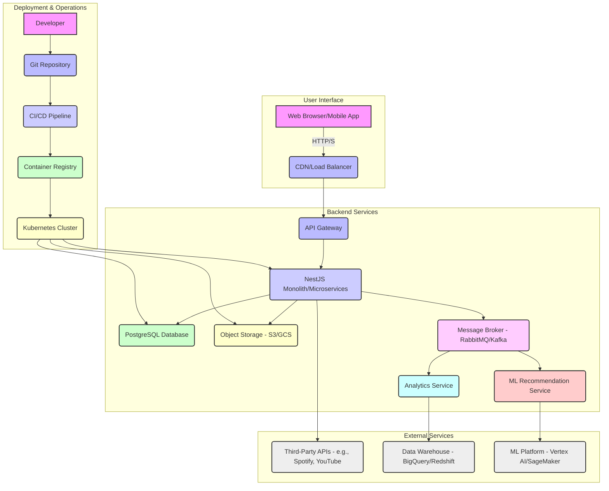

<!-- Summary: This document outlines the technical vision for evolving the Musician Growth App from its static MVP into a robust, scalable, full-stack application, centered around the core concept of a guided "Path to Stardom." It details the proposed technology stack, core database schema for progress tracking, architectural design options (Monolith on PaaS, Monolith on Managed Kubernetes, Serverless Backend), deployment strategies, and the role of Managed Cloud Platforms in accelerating development. It also includes a detailed infrastructure diagram, discusses security implementation, clean code principles, production workflow, and a scaling strategy by user milestones. -->
# Future Architecture: From Static MVP to Full-Stack Powerhouse

This document outlines the technical vision for evolving the Musician Growth App from its simple, static MVP into a robust, scalable, full-stack application, centered around the core concept of a guided "Path to Stardom."

## 1. Phase 1: Introducing a Backend and Database

*Trigger: The need for user accounts, data persistence, and the "Path to Stardom" progress tracking feature.*

### 1.1. Proposed Technology Stack

*   **Backend Framework: Node.js with NestJS**
*   **Database: PostgreSQL**
*   **ORM: Prisma**
*   **Authentication: JWT (JSON Web Tokens)**

### 1.2. Core Database Schema: The "Path to Stardom"

The database schema will be designed explicitly to support our core feature: guiding a musician through their career. This requires a flexible system for goals, tasks, and progress tracking.

```mermaid
erDiagram
    users {
        UUID id PK
        String email
        String password_hash
    }

    profiles {
        UUID id PK
        UUID user_id FK
        String artist_name
        Jsonb current_stats
    }

    roadmaps {
        UUID id PK
        String name
        String description
    }

    roadmap_stages {
        UUID id PK
        UUID roadmap_id FK
        String title
        Integer order
    }

    tasks {
        UUID id PK
        UUID stage_id FK
        String title
        String description
        String task_type // e.g., 'CHECKLIST', 'DATA_INPUT'
    }

    user_task_progress {
        UUID user_id FK
        UUID task_id FK
        String status // 'not_started', 'in_progress', 'completed'
        Jsonb task_data // For storing checklist items, etc.
    }

    users ||--o{ profiles : "has"
    roadmaps ||--o{ roadmap_stages : "has"
    roadmap_stages ||--o{ tasks : "has"
    users ||--|{ tasks : "completes (through user_task_progress)"}
    profiles }|..|{ user_task_progress : "tracks"

```

*   **`roadmaps` & `roadmap_stages`:** These tables will define the templated "Paths to Stardom." We can create different roadmaps for different types of musicians (e.g., "Indie Singer-Songwriter," "Electronic Producer," "Touring Band").
*   **`tasks`:** Each stage of a roadmap contains tasks. A task could be a simple checklist ("Create a social media presence") or a data input ("What is your current monthly streaming number?").
*   **`user_task_progress`:** This is the crucial link. It tracks the status of each task for each user and stores the specific data associated with their progress (e.g., the state of their checklist).

## 2. Full-Stack Architectural Options & Trade-offs

When transitioning from the static MVP to a full-stack application, several architectural patterns can be considered. Each offers different trade-offs in terms of control, operational overhead, and cost.

### 2.1. Option A: Monolith on Platform-as-a-Service (PaaS)

*   **Description:** Deploy the NestJS monolith to a managed PaaS like Heroku, AWS Elastic Beanstalk, or Google App Engine. The provider handles the underlying servers, operating systems, and runtime environments.
*   **Pros:**
    *   **Simplicity & Speed:** Extremely fast to deploy and manage. Developers focus almost entirely on code.
    *   **Reduced Operational Overhead:** Minimal server management, patching, and scaling concerns.
    *   **Cost-Effective for Small Scale:** Predictable pricing for initial stages.
*   **Cons:**
    *   **Less Control:** Limited access to the underlying infrastructure, which can hinder deep customization or debugging.
    *   **Vendor Lock-in:** Migrating away from a specific PaaS can be challenging.
    *   **Potentially Higher Cost at Scale:** As usage grows, PaaS can sometimes become more expensive than IaaS or container orchestration due to the managed service premium.
*   **Best For:** Startups prioritizing rapid development and minimal DevOps effort in early growth phases.

### 2.2. Option B: Monolith on Managed Container Orchestration (Kubernetes)

*   **Description:** Deploy the containerized NestJS monolith to a managed Kubernetes service (e.g., Amazon EKS, Google GKE, Azure AKS). Kubernetes handles container deployment, scaling, and management.
*   **Pros:**
    *   **High Scalability & Resilience:** Designed for horizontal scaling and self-healing, ensuring high availability.
    *   **Portability:** Containers offer better portability across different cloud environments.
    *   **More Control than PaaS:** While managed, Kubernetes provides more granular control over infrastructure than a typical PaaS.
    *   **Cost-Effective at Scale:** Can be more cost-efficient than PaaS for larger, more complex applications.
*   **Cons:**
    *   **Higher Complexity:** Steeper learning curve and more complex setup compared to PaaS. Requires dedicated DevOps expertise.
    *   **Increased Operational Overhead:** Even managed Kubernetes requires some operational management (e.g., cluster upgrades, monitoring).
*   **Best For:** Applications anticipating significant growth, requiring fine-grained control over their infrastructure, and having dedicated DevOps resources.

### 2.3. Option C: Serverless Backend (Function-as-a-Service)

*   **Description:** Break down the NestJS application into smaller, independent serverless functions (e.g., AWS Lambda, Google Cloud Functions, Azure Functions). Code executes only in response to events (e.g., API requests).
*   **Pros:**
    *   **Extreme Scalability:** Automatically scales from zero to massive traffic without manual intervention.
    *   **Pay-per-Use Cost Model:** Only pay when code is executing, eliminating idle costs. Very cost-effective for intermittent or unpredictable workloads.
    *   **Reduced Operational Overhead:** No servers to manage, patch, or scale.
*   **Cons:**
    *   **Architectural Complexity:** Requires significant re-architecting of traditional monolithic applications.
    *   **Cold Starts:** Functions may experience latency on first invocation after a period of inactivity.
    *   **Debugging Challenges:** Debugging distributed serverless functions can be more complex.
    *   **Potential for Cost Spikes:** For very high, consistent traffic, costs can sometimes exceed traditional server models.
*   **Best For:** Specific, event-driven workloads, microservices that are inherently stateless, or applications with highly variable traffic patterns.

## 3. Phase 2: Microservices & Advanced Scalability

*Trigger: The user base grows, and we need to scale specific, high-load parts of the application, like analytics or community features.*

*   **Microservices:** We will strategically break out services from the monolith:
    *   **Roadmap Service:** Manages the templates and logic for the "Path to Stardom."
    *   **Profile Service:** Manages user profiles and their progress data.
    *   **Analytics Service:** A new service to process user progress data and provide visualizations and insights on their dashboard.
*   **Communication:** An **API Gateway** will route requests, and a message broker like **RabbitMQ** will handle asynchronous communication between services (e.g., when a task is completed, it publishes an event for the Analytics Service to process).

## 4. Infrastructure Design Diagram



## 5. Managed Cloud Platforms for Accelerated Development

To accelerate development and reduce operational overhead, we will heavily leverage Managed Cloud Platforms offered by major cloud providers (AWS, GCP, Azure) or specialized PaaS providers.

*   **Managed Kubernetes Service (EKS, GKE, AKS):** Instead of self-managing Kubernetes clusters, using a managed service offloads the burden of control plane management, upgrades, and patching.
*   **Managed Database Service (RDS, Cloud SQL, Azure SQL Database):** These services handle database provisioning, patching, backups, and scaling automatically, freeing up development resources.
*   **Managed Message Broker (Amazon MQ, Google Cloud Pub/Sub, Azure Service Bus):** For asynchronous communication, managed message brokers simplify setup and maintenance compared to self-hosting RabbitMQ or Kafka.
*   **Serverless Functions (AWS Lambda, Google Cloud Functions, Azure Functions):** For specific, event-driven tasks (e.g., image resizing, sending notifications), serverless functions allow us to pay only for compute time and scale automatically.
*   **Vercel/Netlify (for Frontend Deployment):** While our backend will be on a cloud provider, Vercel or Netlify can provide an incredibly fast and efficient deployment pipeline for our React frontend, leveraging their global CDNs and seamless Git integration.
*   **Heroku (Alternative PaaS):** For teams prioritizing extreme simplicity over granular control, Heroku could be considered as an alternative to a full Kubernetes setup. It offers a highly abstracted platform where developers push code, and Heroku handles the underlying infrastructure. While potentially more expensive at scale, its ease of use can significantly speed up initial development and deployment.

By strategically using Managed Cloud Platforms, we can focus our engineering efforts on building core product features rather than managing infrastructure, leading to faster iteration and a more robust application.

## 6. Security Implementation

Security will be a paramount concern throughout the application's lifecycle, following a "security-by-design" approach.

### 6.1. Core Security Principles

*   **Least Privilege:** Users and services will only have the minimum necessary permissions to perform their functions.
*   **Defense in Depth:** Multiple layers of security controls will be implemented to protect against various attack vectors.
*   **Secure by Default:** All configurations will prioritize security, requiring explicit opt-out for less secure options.
*   **Continuous Monitoring:** Security will be an ongoing process, with continuous monitoring, logging, and regular audits.

### 6.2. Key Security Measures

*   **Authentication & Authorization:**
    *   **Strong Passwords & MFA:** Enforce strong password policies and encourage/require multi-factor authentication (MFA) for user accounts.
    *   **JWT Security:** Securely store JWTs (e.g., in HTTP-only cookies) and implement token revocation mechanisms.
    *   **Role-Based Access Control (RBAC):** Define clear roles and permissions to ensure users can only access authorized resources.
*   **Input Validation & Sanitization:**
    *   All user inputs (frontend and backend) will be rigorously validated and sanitized to prevent common attacks like SQL Injection, Cross-Site Scripting (XSS), and Command Injection.
*   **Data Protection:**
    *   **Encryption in Transit:** All communication will use HTTPS/TLS.
    *   **Encryption at Rest:** Sensitive data in the database and object storage will be encrypted.
    *   **Data Minimization:** Only collect and store data that is absolutely necessary.
*   **API Security:**
    *   **Rate Limiting:** Implement rate limiting on API endpoints to prevent brute-force attacks and abuse.
    *   **API Gateway:** Leverage the API Gateway for centralized authentication, authorization, and traffic filtering.
*   **Dependency Management:**
    *   Regularly scan and update all third-party libraries and dependencies to patch known vulnerabilities.
*   **Logging & Monitoring:**
    *   Comprehensive logging of security-relevant events (login attempts, access failures, data modifications).
    *   Real-time monitoring and alerting for suspicious activities.
*   **Web Application Firewall (WAF):** Deploy a WAF to protect against common web attacks (e.g., OWASP Top 10).
*   **Regular Security Audits & Penetration Testing:** Conduct periodic security assessments by independent third parties.

## 7. Clean Code Principles & Production Workflow

Our development process will emphasize clean, extensible, and testable code, supported by a robust production deployment workflow.

### 7.1. Clean Code Principles

We will adhere to the following principles for both React (frontend) and NestJS (backend):

*   **Readability:** Code will be self-documenting with clear, descriptive naming conventions (variables, functions, classes, components).
*   **Modularity & Reusability:** Break down complex features into small, focused, and reusable modules/components/services.
*   **Single Responsibility Principle (SRP):** Each module, class, or component will have only one reason to change.
*   **Testability:** Code will be written with testing in mind, making it easy to unit, integrate, and end-to-end test.
*   **DRY (Don't Repeat Yourself):** Avoid code duplication through abstraction and reusable patterns.
*   **TypeScript:** Leverage TypeScript's static typing extensively to catch errors early and improve code maintainability.
*   **Error Handling:** Implement consistent and robust error handling mechanisms across the application.
*   **Code Formatting & Linting:** Use Prettier for consistent formatting and ESLint for enforcing coding standards and identifying potential issues.

### 7.2. Production Deployment Workflow

Our workflow will be automated and designed for reliability and speed.

1.  **Version Control (Git):** All code will be managed in a Git repository (e.g., GitHub).
2.  **Feature Branches:** Development will occur on feature branches, which are merged into `main` after review.
3.  **Pull Requests & Code Reviews:** All code changes will go through a pull request process with mandatory code reviews to ensure quality and adherence to standards.
4.  **Continuous Integration (CI):**
    *   **Automated Builds:** On every push to a feature branch and `main`, the CI pipeline will automatically build both the React frontend and NestJS backend.
    *   **Automated Testing:** Run all unit, integration, and end-to-end tests.
    *   **Linting & Static Analysis:** Enforce code quality and identify potential bugs.
    *   **Container Image Build:** Build Docker images for both applications.
5.  **Continuous Delivery/Deployment (CD):
    *   **Staging Environment:** Successful builds from `main` will be automatically deployed to a staging environment for final testing and stakeholder review.
    *   **Manual Promotion to Production:** After successful staging, a manual approval step will trigger deployment to production.
    *   **Container Registry:** Docker images will be pushed to a secure container registry (e.g., AWS ECR, Google Container Registry).
    *   **Orchestration:** Kubernetes will manage the deployment and scaling of containers in production.
6.  **Monitoring & Alerting:** Post-deployment, comprehensive monitoring (performance, errors, security) and alerting will be in place to quickly detect and respond to issues.
7.  **Rollback Strategy:** Maintain clear procedures and automated tools for quickly rolling back to a previous stable version in case of critical issues in production.

This workflow ensures that only high-quality, tested code reaches production, minimizing downtime and maximizing reliability.

## 8. Scaling Strategy by User Milestones

This section outlines the planned infrastructure and operational adjustments as the user base grows, ensuring the application remains performant and cost-effective.

### 8.1. Phase 1: Early Adopters (5 - 500 Users)

*   **Focus:** Stability, rapid iteration, and cost-efficiency.
*   **Infrastructure:**
    *   **Frontend:** Still hosted on GitHub Pages (for MVP) or a simple static site host like Vercel/Netlify.
    *   **Backend (Post-MVP):** A single, small-to-medium sized instance on a PaaS (e.g., Heroku Hobby/Standard, AWS Elastic Beanstalk single instance, Google App Engine Standard environment).
    *   **Database:** A managed, small-tier PostgreSQL instance (e.g., Heroku Postgres Hobby Dev, AWS RDS db.t3.micro, Google Cloud SQL db-f1-micro).
    *   **Object Storage:** Minimal usage for static assets (e.g., user profile images) on S3/GCS.
*   **Operations:**
    *   Manual monitoring and alerting.
    *   Basic CI/CD pipeline (e.g., GitHub Actions for automated builds and deployments to PaaS).
*   **Key Considerations:** Keep costs extremely low. Focus on core features and user feedback. The monolith architecture is perfectly fine here.

### 8.2. Phase 2: Growth (500 - 10,000 Users)

*   **Focus:** Performance, reliability, and automated scaling.
*   **Infrastructure:**
    *   **Frontend:** Leverage a global CDN (e.g., CloudFront, Cloudflare) for faster content delivery.
    *   **Backend:** Transition to a managed Kubernetes service (EKS, GKE, AKS) with auto-scaling enabled. Start with 2-3 small-to-medium sized nodes. This allows for horizontal scaling of the NestJS monolith.
    *   **Database:** Upgrade to a larger, highly available managed PostgreSQL instance with read replicas for scaling read operations. Implement connection pooling.
    *   **Caching:** Introduce Redis for caching frequently accessed data (e.g., roadmap templates, user profiles) to reduce database load.
    *   **Message Queue:** Implement RabbitMQ/Kafka for asynchronous tasks (e.g., sending notifications, processing analytics data) to decouple services and improve responsiveness.
    *   **Object Storage:** Continue using S3/GCS, potentially with more advanced features like lifecycle policies.
*   **Operations:**
    *   Implement comprehensive monitoring and alerting (e.g., Prometheus, Grafana, Datadog).
    *   Refine CI/CD pipeline for automated deployments to Kubernetes.
    *   Start planning for microservices extraction for high-load components.
*   **Key Considerations:** Optimize database queries. Monitor application performance closely. Begin identifying bottlenecks for future microservices.

### 8.3. Phase 3: Scale (10,000+ Users)

*   **Focus:** High availability, fault tolerance, cost optimization at scale, and advanced features.
*   **Infrastructure:**
    *   **Frontend:** Continue leveraging global CDN, potentially with edge computing for dynamic content.
    *   **Backend:** Full transition to a microservices architecture. Each microservice (e.g., Roadmap Service, Profile Service, Analytics Service, ML Recommendation Service) will be deployed as independent services within Kubernetes, allowing for granular scaling.
    *   **Database:** Sharding or partitioning of the PostgreSQL database for extreme scale. Explore specialized databases for specific use cases (e.g., NoSQL for user activity logs).
    *   **Data Warehouse:** Implement a dedicated data warehouse (BigQuery, Redshift) for complex analytics and ML model training.
    *   **ML Platform:** Utilize a dedicated ML platform (Vertex AI, SageMaker) for training, deploying, and serving the advanced recommendation engine.
    *   **API Gateway:** Centralized API Gateway for routing, authentication, and rate limiting across microservices.
*   **Operations:**
    *   Advanced observability (distributed tracing, detailed metrics).
    *   Automated chaos engineering to test system resilience.
    *   Dedicated DevOps team.
    *   Cost optimization strategies (reserved instances, spot instances, serverless for appropriate workloads).
*   **Key Considerations:** Focus on resilience and disaster recovery. Implement robust logging and tracing for distributed systems. Continuously optimize infrastructure for cost and performance. Explore global deployments for reduced latency.

This phased approach ensures that infrastructure investments align with user growth, preventing over-provisioning in early stages and providing a clear path for scaling as the application gains traction.