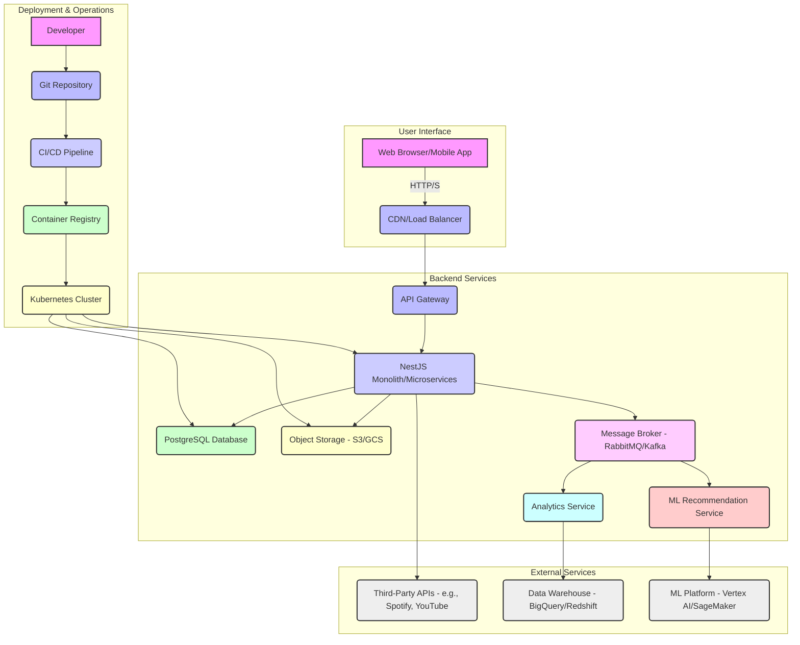
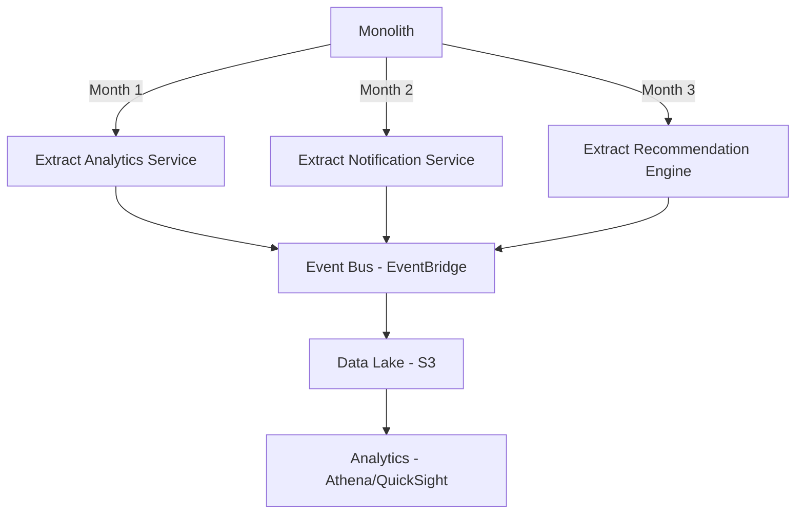

# Future Architecture: From Static MVP to Full-Stack Powerhouse

This document outlines the technical vision for evolving the Musician Growth App from its simple, static MVP into a robust, scalable, full-stack application, centered around the core concept of a guided "Path to Stardom."

## 1. Phase 1: Introducing a Backend and Database

*Trigger: The need for user accounts, data persistence, and the "Path to Stardom" progress tracking feature.*

### 1.1. Proposed Technology Stack

#### **RECOMMENDED STACK DECISION:**

Based on extensive research and cost analysis for startups in 2025, here's the optimal technology stack:

*   **Backend Framework: Node.js with NestJS** ✅
    - **Why**: Type-safe, modular architecture, excellent DX, built-in dependency injection
    - **Alternative considered**: Express.js (simpler but lacks structure for scaling)
    
*   **Database: PostgreSQL with Neon** 🎯 **[STRONG RECOMMENDATION]**
    - **Why Neon over traditional PostgreSQL**:
      - **Scale-to-zero capability**: Only pay when the database is active (perfect for early-stage apps)
      - **Instant branching**: Create database branches for development/testing
      - **0.3 second cold start**: Fastest in the market
      - **Cost**: Free tier includes 0.5GB storage, then $0.02/GB-hour compute
    - **Alternatives considered**:
      - Supabase: Good for auth integration but branches cost $10/month each
      - PlanetScale: Better for write-heavy workloads but MySQL-based
      - Traditional PostgreSQL on RDS: More expensive for intermittent workloads
      
*   **ORM: Prisma** ✅
    - **Why**: Type-safe database queries, excellent migrations, great DX
    - **Alternative**: DrizzleORM (lighter but less mature ecosystem)
    
*   **Authentication: Supabase Auth** 🎯 **[CHANGE RECOMMENDATION]**
    - **Why not JWT**: Managing auth yourself is complex and security-prone
    - **Why Supabase Auth**:
      - Free tier includes 50,000 monthly active users
      - Built-in social auth (Google, Facebook, etc.)
      - Row Level Security integration with PostgreSQL
      - Email/SMS verification out of the box
    - **Cost**: Free up to 50K MAU, then $0.00325 per MAU

### 1.2. Core Database Schema: The "Path to Stardom"

The database schema will be designed explicitly to support our core feature: guiding a musician through their career. This requires a flexible system for goals, tasks, and progress tracking.

```mermaid
erDiagram
    users {
        UUID id PK
        String email
        String password_hash
    }

    profiles {
        UUID id PK
        UUID user_id FK
        String artist_name
        Jsonb current_stats
    }

    roadmaps {
        UUID id PK
        String name
        String description
    }

    roadmap_stages {
        UUID id PK
        UUID roadmap_id FK
        String title
        Integer order
    }

    tasks {
        UUID id PK
        UUID stage_id FK
        String title
        String description
        String task_type // e.g., 'CHECKLIST', 'DATA_INPUT'
    }

    user_task_progress {
        UUID user_id FK
        UUID task_id FK
        String status // 'not_started', 'in_progress', 'completed'
        Jsonb task_data // For storing checklist items, etc.
    }

    users ||--o{ profiles : "has"
    roadmaps ||--o{ roadmap_stages : "has"
    roadmap_stages ||--o{ tasks : "has"
    users ||--|{ tasks : "completes (through user_task_progress)"}
    profiles }|..|{ user_task_progress : "tracks"

```

*   **`roadmaps` & `roadmap_stages`:** These tables will define the templated "Paths to Stardom." We can create different roadmaps for different types of musicians (e.g., "Indie Singer-Songwriter," "Electronic Producer," "Touring Band").
*   **`tasks`:** Each stage of a roadmap contains tasks. A task could be a simple checklist ("Create a social media presence") or a data input ("What is your current monthly streaming number?").
*   **`user_task_progress`:** This is the crucial link. It tracks the status of each task for each user and stores the specific data associated with their progress (e.g., the state of their checklist).

## 2. Full-Stack Architectural Options & Trade-offs

When transitioning from the static MVP to a full-stack application, several architectural patterns can be considered. Each offers different trade-offs in terms of control, operational overhead, and cost.

### 2.1. Option A: Monolith on Platform-as-a-Service (PaaS)

#### **RECOMMENDED DEPLOYMENT: Railway.app** 🎯

*   **Description:** Deploy the NestJS monolith to Railway, a modern PaaS optimized for startups.
    
*   **Why Railway over alternatives:**
    - **Cost**: Base plan only $5/month + usage-based pricing
    - **Zero cold starts**: Unlike Heroku's free tier
    - **Built-in PostgreSQL**: Seamless database integration
    - **GitHub integration**: Deploy on push
    - **Preview environments**: Automatic deployments for PRs
    
*   **Cost Breakdown for Early Stage (0-1000 users):**
    - Railway base: $5/month
    - Compute (512MB RAM): ~$5-10/month
    - Neon database: Free tier
    - **Total: ~$10-15/month**
    
*   **Alternative Options Compared:**
    - **Render**: $19/month base + $25/month for 2GB/1CPU (more expensive)
    - **Heroku**: $5-7/month but with cold starts on cheaper tiers
    - **Vercel**: Better for frontend, serverless functions limited for full backend
    - **AWS Elastic Beanstalk**: More complex, ~$20-30/month minimum
    
*   **Pros:**
    *   **Simplicity & Speed:** Deploy in minutes with `railway up`
    *   **Transparent pricing:** Clear usage-based model
    *   **Modern DX:** Excellent CLI and dashboard
    *   **Easy scaling:** Vertical scaling with one click
    
*   **Cons:**
    *   **Less mature:** Newer platform (but growing fast)
    *   **Limited regions:** Fewer deployment regions than AWS
    *   **No built-in CDN:** Need separate solution for static assets
    
*   **Migration Path:** Railway → AWS/GCP when you hit ~$500/month in hosting costs

### 2.2. Option B: Monolith on Managed Container Orchestration (Kubernetes)

*   **Description:** Deploy the containerized NestJS monolith to a managed Kubernetes service (e.g., Amazon EKS, Google GKE, Azure AKS). Kubernetes handles container deployment, scaling, and management.
*   **Pros:**
    *   **High Scalability & Resilience:** Designed for horizontal scaling and self-healing, ensuring high availability.
    *   **Portability:** Containers offer better portability across different cloud environments.
    *   **More Control than PaaS:** While managed, Kubernetes provides more granular control over infrastructure than a typical PaaS.
    *   **Cost-Effective at Scale:** Can be more cost-efficient than PaaS for larger, more complex applications.
*   **Cons:**
    *   **Higher Complexity:** Steeper learning curve and more complex setup compared to PaaS. Requires dedicated DevOps expertise.
    *   **Increased Operational Overhead:** Even managed Kubernetes requires some operational management (e.g., cluster upgrades, monitoring).
*   **Best For:** Applications anticipating significant growth, requiring fine-grained control over their infrastructure, and having dedicated DevOps resources.

### 2.3. Option C: Serverless Backend (Function-as-a-Service)

*   **Description:** Break down the NestJS application into smaller, independent serverless functions (e.g., AWS Lambda, Google Cloud Functions, Azure Functions). Code executes only in response to events (e.g., API requests).
*   **Pros:**
    *   **Extreme Scalability:** Automatically scales from zero to massive traffic without manual intervention.
    *   **Pay-per-Use Cost Model:** Only pay when code is executing, eliminating idle costs. Very cost-effective for intermittent or unpredictable workloads.
    *   **Reduced Operational Overhead:** No servers to manage, patch, or scale.
*   **Cons:**
    *   **Architectural Complexity:** Requires significant re-architecting of traditional monolithic applications.
    *   **Cold Starts:** Functions may experience latency on first invocation after a period of inactivity.
    *   **Debugging Challenges:** Debugging distributed serverless functions can be more complex.
    *   **Potential for Cost Spikes:** For very high, consistent traffic, costs can sometimes exceed traditional server models.
*   **Best For:** Specific, event-driven workloads, microservices that are inherently stateless, or applications with highly variable traffic patterns.

## 3. Phase 2: Microservices & Advanced Scalability

*Trigger: The user base grows beyond 10,000 active users, or specific services need independent scaling.*

### **RECOMMENDED MICROSERVICES ARCHITECTURE:**

#### **Core Services to Extract First:**

1. **Analytics Service** (Extract at ~5,000 users)
   - **Why first**: Heavy compute, different scaling needs
   - **Tech**: Node.js worker with BullMQ for job processing
   - **Deploy on**: Railway worker dyno or AWS Lambda
   - **Cost impact**: +$10-20/month

2. **Notification Service** (Extract at ~10,000 users)
   - **Why**: Async processing, third-party integrations
   - **Tech**: Dedicated service for email/push notifications
   - **Deploy on**: Serverless (AWS Lambda/Vercel Functions)
   - **Cost impact**: ~$0-10/month with pay-per-use

3. **Recommendation Engine** (Extract at ~20,000 users)
   - **Why**: CPU intensive, could benefit from Python/ML libraries
   - **Tech**: Python FastAPI service
   - **Deploy on**: Container on Railway or AWS Fargate
   - **Cost impact**: +$20-30/month

#### **Communication Infrastructure:**

*   **Message Queue: Redis with BullMQ** 🎯 **[RECOMMENDED]**
    - **Why not RabbitMQ**: More complex for small teams
    - **Why BullMQ**: 
      - Built on Redis (which you'll already have for caching)
      - Great Node.js integration
      - Simple setup
    - **Cost**: Upstash Redis free tier (10,000 commands/day)
    
*   **API Gateway: Keep it simple initially**
    - Start with NestJS built-in routing
    - Move to Kong or AWS API Gateway only when you need:
      - Rate limiting per client
      - API key management
      - Complex routing rules

#### **Inter-Service Communication:**

```typescript
// Recommended pattern: Event-driven with TypeScript types
interface TaskCompletedEvent {
  userId: string;
  taskId: string;
  completedAt: Date;
  metadata: Record<string, any>;
}

// Publisher (in main service)
await queue.add('task.completed', eventData);

// Consumer (in analytics service)  
queue.process('task.completed', async (job) => {
  await updateUserAnalytics(job.data);
});
```

## 4. Infrastructure Design Diagram



## 5. Managed Cloud Platforms for Accelerated Development

### **RECOMMENDED PLATFORM STACK FOR STARTUPS:**

#### **Phase 1 (0-1,000 users) - Total: ~$15-30/month**

1. **Frontend Hosting: Vercel** ✅
   - **Free tier**: Perfect for Next.js/React apps
   - **Includes**: SSL, global CDN, preview deployments
   - **When to upgrade**: At ~100GB bandwidth/month ($20/month Pro)

2. **Backend Hosting: Railway** ✅
   - **Cost**: $5 base + ~$10 usage
   - **Includes**: Auto-scaling, zero-downtime deploys
   
3. **Database: Neon** ✅
   - **Free tier**: 0.5GB storage, 10GB bandwidth
   - **Branch databases**: Included in free tier
   
4. **File Storage: Cloudflare R2** 🎯 **[RECOMMENDED]**
   - **Why not S3**: No egress fees!
   - **Cost**: $0.015/GB stored, $0.36/million requests
   - **Free tier**: 10GB storage, 1M requests/month

5. **Email Service: Resend** 🎯 **[NEW RECOMMENDATION]**
   - **Why**: Modern API, great DX, generous free tier
   - **Free tier**: 3,000 emails/month
   - **Alternative**: AWS SES (cheaper at scale but complex setup)

#### **Phase 2 (1,000-10,000 users) - Total: ~$100-300/month**

1. **Add Redis Cache: Upstash** ✅
   - **Serverless Redis**: Pay per request
   - **Free tier**: 10,000 commands/day
   - **Scaling cost**: ~$0.2 per 100K commands

2. **Add Search: Algolia** 
   - **Free tier**: 10,000 searches/month
   - **Why**: Instant search, great React components
   - **Alternative**: Elasticsearch on Railway (~$40/month)

3. **Monitoring: Sentry + Vercel Analytics**
   - **Sentry free tier**: 5,000 errors/month
   - **Vercel Analytics**: Included in Pro plan
   - **Alternative**: Datadog ($31/host/month - wait until Phase 3)

4. **CDN for Media: Cloudflare**
   - **Free tier**: Unlimited bandwidth
   - **Why**: Combine with R2 for zero egress costs

#### **Phase 3 (10,000+ users) - Total: ~$500-2000/month**

**Decision Point**: At ~$500/month hosting costs, consider moving to AWS/GCP for:
- 20-30% cost savings at scale
- More control over infrastructure
- Better multi-region support

**Recommended Migration Path**:
1. Keep Vercel for frontend (it scales efficiently)
2. Move backend to AWS ECS Fargate or Google Cloud Run
3. Move database to AWS RDS or stay with Neon (it scales well)
4. Implement proper DevOps with Terraform/Pulumi

### **COST OPTIMIZATION TIPS:**

1. **Use Serverless for Variable Workloads**
   - Notification sending
   - Image processing  
   - Report generation
   - Webhook processing

2. **Leverage Free Tiers Strategically**
   - Cloudflare for CDN/DDoS protection (always free)
   - GitHub Actions for CI/CD (2,000 minutes/month free)
   - Neon's scale-to-zero for development databases

3. **Monitor Costs Weekly**
   - Set up billing alerts at 50%, 80%, 100% of budget
   - Use Railway's usage dashboard
   - Track Vercel bandwidth closely

4. **Avoid These Common Traps**
   - Netlify's bandwidth pricing (gets expensive fast)
   - Heroku's dyno sleeping (bad UX)
   - AWS without Reserved Instances (30-70% more expensive)
   - Storing media files in Git LFS (use R2 instead)

By strategically using Managed Cloud Platforms, we can focus our engineering efforts on building core product features rather than managing infrastructure, leading to faster iteration and a more robust application.

## 6. Security Implementation

Security will be a paramount concern throughout the application's lifecycle, following a "security-by-design" approach.

### 6.1. Core Security Principles

*   **Least Privilege:** Users and services will only have the minimum necessary permissions to perform their functions.
*   **Defense in Depth:** Multiple layers of security controls will be implemented to protect against various attack vectors.
*   **Secure by Default:** All configurations will prioritize security, requiring explicit opt-out for less secure options.
*   **Continuous Monitoring:** Security will be an ongoing process, with continuous monitoring, logging, and regular audits.

### 6.2. Key Security Measures

*   **Authentication & Authorization:**
    *   **Strong Passwords & MFA:** Enforce strong password policies and encourage/require multi-factor authentication (MFA) for user accounts.
    *   **JWT Security:** Securely store JWTs (e.g., in HTTP-only cookies) and implement token revocation mechanisms.
    *   **Role-Based Access Control (RBAC):** Define clear roles and permissions to ensure users can only access authorized resources.
*   **Input Validation & Sanitization:**
    *   All user inputs (frontend and backend) will be rigorously validated and sanitized to prevent common attacks like SQL Injection, Cross-Site Scripting (XSS), and Command Injection.
*   **Data Protection:**
    *   **Encryption in Transit:** All communication will use HTTPS/TLS.
    *   **Encryption at Rest:** Sensitive data in the database and object storage will be encrypted.
    *   **Data Minimization:** Only collect and store data that is absolutely necessary.
*   **API Security:**
    *   **Rate Limiting:** Implement rate limiting on API endpoints to prevent brute-force attacks and abuse.
    *   **API Gateway:** Leverage the API Gateway for centralized authentication, authorization, and traffic filtering.
*   **Dependency Management:**
    *   Regularly scan and update all third-party libraries and dependencies to patch known vulnerabilities.
*   **Logging & Monitoring:**
    *   Comprehensive logging of security-relevant events (login attempts, access failures, data modifications).
    *   Real-time monitoring and alerting for suspicious activities.
*   **Web Application Firewall (WAF):** Deploy a WAF to protect against common web attacks (e.g., OWASP Top 10).
*   **Regular Security Audits & Penetration Testing:** Conduct periodic security assessments by independent third parties.

## 7. Clean Code Principles & Production Workflow

Our development process will emphasize clean, extensible, and testable code, supported by a robust production deployment workflow.

### 7.1. Clean Code Principles

We will adhere to the following principles for both React (frontend) and NestJS (backend):

*   **Readability:** Code will be self-documenting with clear, descriptive naming conventions (variables, functions, classes, components).
*   **Modularity & Reusability:** Break down complex features into small, focused, and reusable modules/components/services.
*   **Single Responsibility Principle (SRP):** Each module, class, or component will have only one reason to change.
*   **Testability:** Code will be written with testing in mind, making it easy to unit, integrate, and end-to-end test.
*   **DRY (Don't Repeat Yourself):** Avoid code duplication through abstraction and reusable patterns.
*   **TypeScript:** Leverage TypeScript's static typing extensively to catch errors early and improve code maintainability.
*   **Error Handling:** Implement consistent and robust error handling mechanisms across the application.
*   **Code Formatting & Linting:** Use Prettier for consistent formatting and ESLint for enforcing coding standards and identifying potential issues.

### 7.2. Production Deployment Workflow

Our workflow will be automated and designed for reliability and speed.

1.  **Version Control (Git):** All code will be managed in a Git repository (e.g., GitHub).
2.  **Feature Branches:** Development will occur on feature branches, which are merged into `main` after review.
3.  **Pull Requests & Code Reviews:** All code changes will go through a pull request process with mandatory code reviews to ensure quality and adherence to standards.
4.  **Continuous Integration (CI):**
    *   **Automated Builds:** On every push to a feature branch and `main`, the CI pipeline will automatically build both the React frontend and NestJS backend.
    *   **Automated Testing:** Run all unit, integration, and end-to-end tests.
    *   **Linting & Static Analysis:** Enforce code quality and identify potential bugs.
    *   **Container Image Build:** Build Docker images for both applications.
5.  **Continuous Delivery/Deployment (CD):
    *   **Staging Environment:** Successful builds from `main` will be automatically deployed to a staging environment for final testing and stakeholder review.
    *   **Manual Promotion to Production:** After successful staging, a manual approval step will trigger deployment to production.
    *   **Container Registry:** Docker images will be pushed to a secure container registry (e.g., AWS ECR, Google Container Registry).
    *   **Orchestration:** Kubernetes will manage the deployment and scaling of containers in production.
6.  **Monitoring & Alerting:** Post-deployment, comprehensive monitoring (performance, errors, security) and alerting will be in place to quickly detect and respond to issues.
7.  **Rollback Strategy:** Maintain clear procedures and automated tools for quickly rolling back to a previous stable version in case of critical issues in production.

This workflow ensures that only high-quality, tested code reaches production, minimizing downtime and maximizing reliability.

## 8. Scaling Strategy by User Milestones

This section outlines the planned infrastructure and operational adjustments as the user base grows, ensuring the application remains performant and cost-effective.

### 8.1. Phase 1: Early Adopters (5 - 500 Users)

*   **Focus:** Stability, rapid iteration, and cost-efficiency.
*   **Infrastructure Budget: $10-30/month**
    
#### **EXACT SETUP INSTRUCTIONS:**

1. **Frontend Deployment:**
   ```bash
   # Deploy to Vercel (from project root)
   npm i -g vercel
   vercel --prod
   ```
   - **Cost**: FREE
   - **Custom domain**: Free with Vercel
   - **Analytics**: Included

2. **Backend Deployment:**
   ```bash
   # Deploy to Railway
   npm i -g @railway/cli
   railway login
   railway up
   ```
   - **Cost**: $5 base + ~$5-10 usage
   - **Environment variables**: Set in Railway dashboard
   - **Automatic SSL**: Included

3. **Database Setup:**
   ```bash
   # Create Neon database
   # 1. Sign up at neon.tech
   # 2. Create project
   # 3. Copy connection string to Railway env vars
   ```
   - **Cost**: FREE (0.5GB storage)
   - **Branching**: Use for dev/staging environments
   - **Connection pooling**: Enabled by default

4. **Monitoring Setup:**
   ```typescript
   // Add to main.ts
   import * as Sentry from '@sentry/node';
   
   Sentry.init({
     dsn: process.env.SENTRY_DSN,
     environment: process.env.NODE_ENV,
     tracesSampleRate: 0.1, // 10% sampling to stay in free tier
   });
   ```
   - **Cost**: FREE (5K errors/month)
   - **Setup time**: 10 minutes

5. **CI/CD Pipeline (.github/workflows/deploy.yml):**
   ```yaml
   name: Deploy
   on:
     push:
       branches: [main]
   
   jobs:
     test:
       runs-on: ubuntu-latest
       steps:
         - uses: actions/checkout@v3
         - uses: actions/setup-node@v3
         - run: npm ci
         - run: npm test
         - run: npm run lint
     
     deploy:
       needs: test
       runs-on: ubuntu-latest
       steps:
         - uses: actions/checkout@v3
         - run: npm i -g @railway/cli
         - run: railway up
           env:
             RAILWAY_TOKEN: ${{ secrets.RAILWAY_TOKEN }}
   ```
   - **Cost**: FREE (2000 minutes/month)
   - **Deploy time**: ~3-5 minutes

*   **Key Metrics to Track:**
    - Page load time (target: <3s)
    - API response time (target: <200ms)
    - Error rate (target: <1%)
    - Monthly active users
    - User retention (day 1, 7, 30)

### 8.2. Phase 2: Growth (500 - 10,000 Users)

*   **Focus:** Performance, reliability, and automated scaling.
*   **Infrastructure Budget: $100-300/month**

#### **SCALING CHECKLIST:**

1. **Frontend Optimization:**
   - **Add Cloudflare** (FREE tier):
     ```bash
     # 1. Add domain to Cloudflare
     # 2. Update nameservers
     # 3. Enable these settings:
     - Auto Minify: ON
     - Brotli: ON  
     - HTTP/3: ON
     - Cache Level: Standard
     ```
   - **Implement these performance optimizations:**
     ```typescript
     // Image optimization with next/image
     import Image from 'next/image';
     
     // Code splitting
     const HeavyComponent = dynamic(() => import('./HeavyComponent'), {
       loading: () => <Skeleton />,
       ssr: false
     });
     
     // Add Web Vitals tracking
     export function reportWebVitals(metric) {
       if (metric.label === 'web-vital') {
         analytics.track('Web Vitals', metric);
       }
     }
     ```

2. **Backend Scaling on Railway:**
   - **Horizontal scaling**: Increase replicas in Railway dashboard
   - **Add health checks**:
     ```typescript
     @Controller('health')
     export class HealthController {
       @Get()
       check() {
         return { 
           status: 'ok', 
           timestamp: new Date().toISOString(),
           uptime: process.uptime()
         };
       }
     }
     ```
   - **Configure auto-scaling**: Set min 2, max 5 replicas

3. **Database Optimization:**
   - **Enable Neon autoscaling**: Automatically scales compute
   - **Add read replica** (when needed):
     ```typescript
     // prisma.schema
     datasource db {
       provider = "postgresql"
       url      = env("DATABASE_URL")
     }
     
     datasource readDb {
       provider = "postgresql"  
       url      = env("DATABASE_REPLICA_URL")
     }
     ```
   - **Implement connection pooling with PgBouncer** (Neon provides this)

4. **Add Caching Layer - Upstash Redis:**
   ```typescript
   import { Redis } from '@upstash/redis';
   
   const redis = new Redis({
     url: process.env.UPSTASH_REDIS_URL,
     token: process.env.UPSTASH_REDIS_TOKEN,
   });
   
   // Cache roadmap templates (they rarely change)
   async getRoadmapTemplate(id: string) {
     const cached = await redis.get(`roadmap:${id}`);
     if (cached) return cached;
     
     const roadmap = await this.prisma.roadmap.findUnique({ where: { id }});
     await redis.set(`roadmap:${id}`, roadmap, { ex: 3600 }); // 1 hour
     return roadmap;
   }
   ```
   - **Cost**: Free tier then ~$0.2 per 100K commands

5. **Add Background Jobs with BullMQ:**
   ```typescript
   import { Queue, Worker } from 'bullmq';
   
   // Create queue
   const emailQueue = new Queue('emails', {
     connection: redis,
   });
   
   // Add job
   await emailQueue.add('welcome', { 
     userId, 
     email 
   });
   
   // Process jobs (in separate worker)
   new Worker('emails', async job => {
     if (job.name === 'welcome') {
       await sendWelcomeEmail(job.data);
     }
   }, { connection: redis });
   ```

6. **Enhanced Monitoring Stack:**
   - **Application Monitoring**: Sentry (upgrade to $26/month Team plan)
   - **Uptime Monitoring**: BetterUptime (free tier - 10 monitors)
   - **Log Aggregation**: Axiom ($25/month for 0.5TB)
   - **Performance Monitoring**: Vercel Analytics (included with Pro)

*   **Key Performance Targets:**
    - API p95 latency: <100ms
    - Database query p95: <50ms  
    - Cache hit rate: >80%
    - Error rate: <0.1%
    - Uptime: 99.9%

### 8.3. Phase 3: Scale (10,000+ Users)

*   **Focus:** High availability, fault tolerance, cost optimization at scale.
*   **Infrastructure Budget: $500-2000/month**

#### **MIGRATION TO CLOUD NATIVE ARCHITECTURE:**

##### **1. When to Migrate (Clear Triggers):**
- Monthly hosting > $500 on Railway
- Need multi-region deployment
- Require 99.99% uptime SLA
- Complex compliance requirements

##### **2. Recommended Cloud Architecture (AWS):**

```yaml
# Infrastructure as Code with AWS CDK
const app = new cdk.App();

const stack = new MusicianGrowthStack(app, 'Production', {
  env: { account: '123456789', region: 'us-east-1' }
});

// ECS Fargate for backend services
const cluster = new ecs.Cluster(stack, 'Cluster');

const backendService = new ecs_patterns.ApplicationLoadBalancedFargateService(stack, 'Backend', {
  cluster,
  cpu: 512,
  desiredCount: 3,
  taskImageOptions: {
    image: ecs.ContainerImage.fromRegistry('musician-growth/backend'),
    environment: {
      NODE_ENV: 'production',
    },
  },
});

// Auto-scaling
const scaling = backendService.service.autoScaleTaskCount({
  maxCapacity: 10,
  minCapacity: 2,
});

scaling.scaleOnCpuUtilization('CpuScaling', {
  targetUtilizationPercent: 70,
});

// RDS PostgreSQL
const database = new rds.DatabaseInstance(stack, 'Database', {
  engine: rds.DatabaseInstanceEngine.postgres({
    version: rds.PostgresEngineVersion.VER_15_2,
  }),
  instanceType: ec2.InstanceType.of(ec2.InstanceClass.T3, ec2.InstanceSize.MEDIUM),
  multiAz: true, // High availability
  allocatedStorage: 100,
  storageEncrypted: true,
});
```

##### **3. Microservices Extraction Plan:**



##### **4. Cost Breakdown at Scale:**

| Service | 10K Users | 50K Users | 100K Users |
|---------|-----------|-----------|------------|
| **Compute (ECS Fargate)** | $150/mo | $500/mo | $1000/mo |
| **Database (RDS)** | $100/mo | $300/mo | $600/mo |
| **Cache (ElastiCache)** | $50/mo | $150/mo | $300/mo |
| **CDN (CloudFront)** | $20/mo | $100/mo | $200/mo |
| **Storage (S3)** | $10/mo | $50/mo | $100/mo |
| **Monitoring** | $50/mo | $200/mo | $400/mo |
| **Total** | ~$380/mo | ~$1300/mo | ~$2600/mo |

##### **5. Advanced Features to Implement:**

1. **Multi-Region Deployment:**
   ```typescript
   // Use DynamoDB Global Tables for session data
   const table = new dynamodb.Table(this, 'Sessions', {
     partitionKey: { name: 'sessionId', type: dynamodb.AttributeType.STRING },
     replicationRegions: ['us-west-2', 'eu-west-1'],
     billingMode: dynamodb.BillingMode.PAY_PER_REQUEST,
   });
   ```

2. **ML-Powered Recommendations:**
   ```python
   # SageMaker endpoint for recommendations
   predictor = sagemaker.predictor.Predictor(
       endpoint_name='musician-growth-recommendations',
       serializer=JSONSerializer(),
       deserializer=JSONDeserializer()
   )
   
   # Get personalized recommendations
   result = predictor.predict({
       'user_id': user_id,
       'features': user_features
   })
   ```

3. **Real-time Analytics Pipeline:**
   ```typescript
   // Kinesis Data Streams for real-time events
   const stream = new kinesis.Stream(this, 'EventStream', {
     shardCount: 3,
     retentionPeriod: cdk.Duration.days(7),
   });
   
   // Process with Lambda
   new lambda.Function(this, 'StreamProcessor', {
     runtime: lambda.Runtime.NODEJS_18_X,
     handler: 'processor.handler',
     events: [
       new KinesisEventSource(stream, {
         startingPosition: lambda.StartingPosition.LATEST,
         batchSize: 100,
       })
     ],
   });
   ```

##### **6. Disaster Recovery Plan:**

- **RTO (Recovery Time Objective)**: 1 hour
- **RPO (Recovery Point Objective)**: 15 minutes
- **Backup Strategy**:
  - Database: Automated snapshots every 6 hours
  - Code: Multi-region artifact storage
  - Data: S3 cross-region replication
- **Runbooks**: Automated failover procedures

##### **7. Cost Optimization Strategies:**

1. **Reserved Instances**: 40-60% savings on compute
2. **Spot Instances**: For batch jobs and non-critical workloads
3. **S3 Intelligent-Tiering**: Automatic cost optimization for storage
4. **Lambda for Variable Workloads**: Pay only when code runs
5. **Scheduled Scaling**: Reduce capacity during off-peak hours

```typescript
// Example: Scheduled scaling
const schedule = new applicationautoscaling.Schedule(this, 'NightScale', {
  schedule: applicationautoscaling.Schedule.cron({ 
    hour: '22', 
    minute: '0' 
  }),
});

scaling.scaleOnSchedule('ScaleDown', {
  schedule,
  minCapacity: 1,
  maxCapacity: 1,
});
```

This phased approach ensures cost-effective scaling while maintaining high performance and reliability as your user base grows from startup to scale.